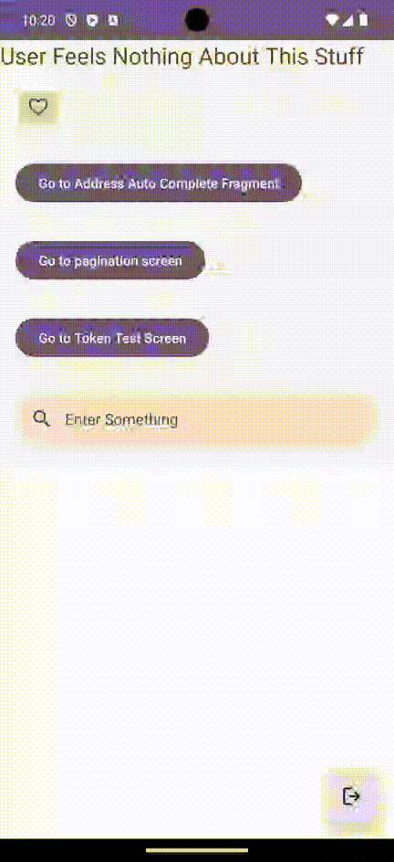
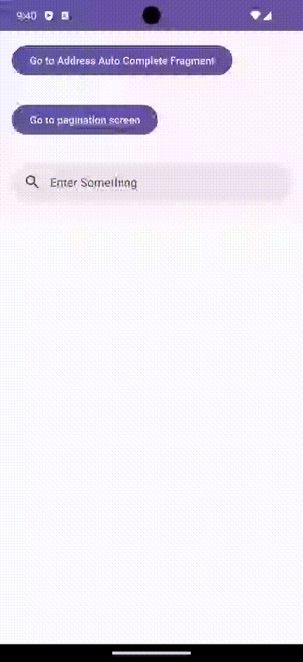

## Optimistic UI + Throttling: Like Button

- Optimistic UI: The like button is updated immediately after the user clicks on it, without waiting for the server response.
- Throttling: The change like status request is throttled (250 ms) to prevent frequent on-off clicks to overload the server.

## Search Bar with Throttling

## Address Auto Complete

## API request with Pagination 

